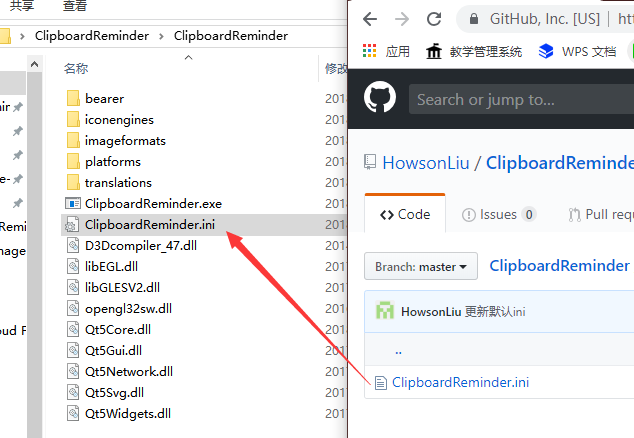

# ClipboardReminder
剪贴板提示器，用来提示你剪贴板东西的小工具 
那么，请问怎么才能用到呢？ 
* 首先呢，我们下载并解压release中的rar 
 
* 接着运行ClipboardReminder.exe 
 
* 运行成功的话会有消息提示，注意只能运行一个哦（其实错了也没提示） 
 
* 接着我们随便复制一段文字，就会有提醒 
 
* 截图也是哦 
 
* 位置不合适可以直接用鼠标拉 
 
* 默认一秒后自动关闭，可以通过右键托盘图标设置 
 
* 如果你想要自定义时间或是大小的话，可以下载ini文件放到exe旁边自定义哦 
 
* ini文件内容是这样 
 

# ClipboardReminder 1.1
改动  
* 在文件头添加了我的签名
* 添加了令人高兴的开机启动
# ClipboardReminder 1.2
改动
有儿子说每次都要从中间移到右上角有点烦，那我就勉为其难改一下吧
# ClipboardReminder 1.3   
**Optimize:** 
Delete the useless .ui suffix file and update the repo directory structure 
**Update:** 
Before version 1.3, the tips existed as a window, so the following would occur: 
 
When we press Alt + TAB, the prompt window appears in all the Windows that allow toggling, which is incorrect.
This bug was fixed in this version.

## 关于开机启动
* 好消息是: 需要以管理员权限运行才能添加到开机启动
* 坏消息是: 你添加一次之后本程序不提供取消开机启动的功能
当然你可以用在 \HKEY_LOCAL_MACHINE\SOFTWARE\Microsoft\Windows\CurrentVersion\Run中删除ClipboardReminder键就可以了
